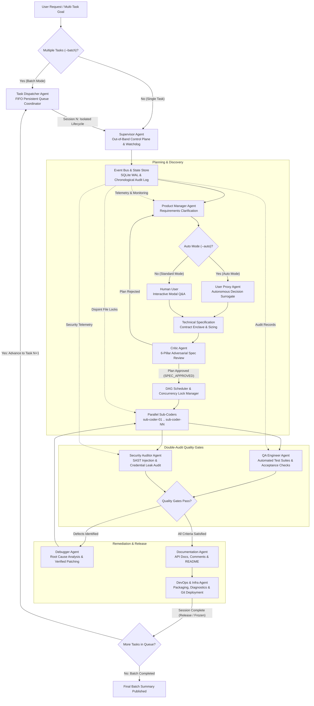

# IT Agent Team

Autonomous Multi-Agent IT Engineering Framework for Antigravity, Gemini CLI, Claude Code, Cursor, Windsurf, and GitHub Copilot.

---

## Executive Summary

IT Agent Team is an enterprise-grade, multi-platform autonomous multi-agent software engineering framework. It orchestrates a specialized roster of 12 autonomous agents through a deterministic, contract-driven engineering lifecycle.

The framework decouples the Out-of-Band Control Plane (Supervisor, Event Bus, Durable State Store, Physical Concurrency Lock Manager, Multi-Task Queue Dispatcher) from the In-Band Execution Engine (Orchestrator, Product Manager, User Proxy, Critic, Parallel Sub-Coders, QA Functional Lead, Security Auditor, Debugger, DevOps, and Documentation). By enforcing mathematical task sizing (N <= 5 files per sub-coder), non-overlapping file allowlists, and sequential multi-task session isolation, IT Agent Team delivers parallel execution with zero write collisions, comprehensive double-audit quality gates, and automated crash recovery.

---

## Universal Multi-Platform Compatibility

IT Agent Team is engineered from the ground up for true cross-platform universality across operating systems and AI coding environments:

### 1. Operating System Compatibility
- Windows: Native PowerShell installer (install.ps1), Windows Terminal, and command line support.
- macOS: POSIX Bash installer (install.sh), Apple Silicon and Intel support, Homebrew-friendly.
- Linux & WSL: POSIX Bash installer (install.sh), support across Ubuntu, Debian, Fedora, Arch, Alpine, and WSL2 environments.
- Zero External Dependencies: Core runtime and tooling use Python 3.10+ standard library (sqlite3, pathlib, json, dataclasses).

### 2. AI Coding Agent & Editor Integration
- Google Antigravity (AGY): Discovered natively via `~/.gemini/config/plugins/agent-team` or workspace `.agents/plugins/agent-team`.
- Gemini CLI: Registered as a native extension with `gemini-extension.json` and slash command `/agent-team`.
- Claude Code: Full marketplace catalog compatibility via `.claude-plugins/marketplace.json`.
- Cursor IDE: Rule synchronization to `.cursorrules` and `.cursor/rules/it-agent-team.mdc`.
- Windsurf IDE: Rule synchronization to `.windsurfrules`.
- GitHub Copilot CLI & VS Code: Instruction synchronization to `.github/copilot-instructions.md`.
- Universal Agents (Codex, Aider, Cline): Standardized `AGENTS.md` and `.agent/rules/AGENTS.md` format.

---

## Architectural Workflow



---

## Complete Agent Roster

The framework employs 12 specialized agent roles across the entire software delivery lifecycle:

| Agent Identifier | Role | Core Responsibilities | Recommended Model Tier |
| :--- | :--- | :--- | :--- |
| task-dispatcher-agent | Multi-Task Sequential Queue Coordinator | Parses multi-task batches, maintains persistent FIFO task queue, initializes isolated Agent Team sessions sequentially per task. | High-Context Generalist (Gemini 2.5 Pro / Claude 3.7 Sonnet) |
| supervisor-agent | Out-of-Band Control Plane & Observability | State store management (SQLite/JSON), audit logging, file guard and concurrency locks, system telemetry, heartbeat monitoring. | Flagship Reasoning (Gemini 2.5 Pro / Claude 3.7 Sonnet) |
| orchestrator-agent | In-Band Workflow & DAG Coordination | Execution DAG scheduling, agent dispatch, task lifecycle tracking, inter-agent message routing, phase transition management. | Flagship Reasoning (Gemini 2.5 Pro / Claude 3.7 Sonnet) |
| pm-agent | Requirements Discovery & Spec Authoring | Problem framing, user intent clarification, technical specification authoring, sub-coder task sizing (N <= 5 files/agent). | High-Context Generalist (Gemini 2.5 Pro / Claude 3.7 Sonnet) |
| user-proxy-agent | Autonomous User Surrogate & Decision Proxy | Operates in Auto Mode (--auto) to resolve requirements options and trade-offs on behalf of the user, eliminating interactive pauses. | High-Context Generalist / Reasoning (Gemini 2.5 Pro / Claude 3.7 Sonnet) |
| critic-agent | Adversarial Plan Critique & Quality Gate | Pre-flight adversarial review, 6-pillar critique matrix (feasibility, edge cases, contracts, concurrency, security, testability), plan sign-off. | Deep Reasoning (Gemini 2.5 Pro Thinking / Claude 3.7 Sonnet Thinking) |
| sub-coder | Parallel Surgical Code Generation | Disjoint file implementation against verbatim contract enclaves, localized unit testing, syntax validation, strict diff compliance. | High-Throughput Coding (Gemini 2.5 Flash / Claude 3.5 Sonnet) |
| qa-agent | Quality Assurance & Functional Verification | Automated test suite execution, blackbox/whitebox test suites, regression analysis, measurable acceptance criteria validation. | High-Throughput Coding / Reasoning (Gemini 2.5 Pro / Flash) |
| security-agent | Security Hardening & Vulnerability Audit | Static Application Security Testing (SAST), secret leak detection, dependency vulnerability scanning, authorization and permission review. | Deep Reasoning / Security (Gemini 2.5 Pro / Claude 3.7 Sonnet) |
| debugger-agent | Remediation & Root Cause Analysis | Pragmatic failure diagnosis, stack trace inspection, surgical patch generation, remediation loop verification. | High-Context Debugging (Gemini 2.5 Pro / Claude 3.7 Sonnet) |
| doc-refactor-agent | Technical Documentation & Knowledge Management | Technical documentation authoring, README maintenance, architectural diagrams, code comments hygiene, style and formatting compliance. | Balanced Generalist (Gemini 2.5 Flash / Pro) |
| devops-infra-agent | Release Engineering & Environment Operations | Environment verification (doctor.py), packaging, CI/CD pipeline automation, Git repository lifecycle, release tag management. | Fast Automation / Tooling (Gemini 2.5 Flash) |

---

## Installation Methods

### Method 1: Marketplace Installation (Claude Code & Antigravity)

Add the repository as a marketplace catalog and install the plugin using standard commands:

```bash
/plugin marketplace add Kaivian/it-agent-team
/plugin install agent-team@it-agent-team
```

### Method 2: One-Line PowerShell Command (Windows)

Run the automated installer in Windows PowerShell:

```powershell
irm https://raw.githubusercontent.com/Kaivian/it-agent-team/main/install.ps1 | iex
```

### Method 3: One-Line POSIX Bash Command (macOS, Linux, WSL)

Run the automated installer in terminal:

```bash
curl -fsSL https://raw.githubusercontent.com/Kaivian/it-agent-team/main/install.sh | bash
```

### Method 4: Antigravity CLI Direct Installation

Install from a local cloned directory or specific path:

```bash
agy plugin install <directory>
```

Example for global plugin location:

```bash
agy plugin install ~/.gemini/config/plugins/agent-team
```

### Method 5: Universal Rule Export to Any Project (Cursor, Windsurf, Copilot)

To apply the IT Agent Team operational invariants to an existing codebase for Cursor, Windsurf, or GitHub Copilot:

```bash
python scripts/export_rules.py /path/to/your/project
```

Options:
- `--platform all`: Installs AGENTS.md, .cursorrules, .github/copilot-instructions.md, and .windsurfrules.
- `--platform cursor`: Installs `.cursor/rules/it-agent-team.mdc` and `.cursorrules`.
- `--platform copilot`: Installs `.github/copilot-instructions.md`.
- `--platform windsurf`: Installs `.windsurfrules`.
- `--platform universal`: Installs root `AGENTS.md` and `.agent/rules/AGENTS.md`.

---

## System Diagnostics

Verify host environment readiness, platform detection, manifest integrity, and agent roster readiness:

```bash
python scripts/doctor.py
```

### Verification Checks Performed:
- OS Platform Detection: Identifies host operating system and CPU architecture.
- Agent Environment Detection: Detects installed tools (Google Antigravity, Gemini CLI, Claude Code, Cursor, VS Code).
- Python Environment: Verifies Python 3.10+ runtime.
- SQLite3 Engine: Validates built-in SQLite3 engine availability.
- Git CLI: Verifies git executable availability in system PATH.
- Manifest Validation: Confirms JSON schema validity for `plugin.json`, `gemini-extension.json`, and `.claude-plugins/marketplace.json`.
- Agent Roster Integrity: Confirms presence and non-empty status of all 12 agent specifications in `agents/`.
- Skills Roster Integrity: Confirms presence and non-empty status of all 5 command skills in `skills/`.

Output uses structured bracketed tags (`[PASS]`, `[WARN]`, `[FAIL]`) and returns exit code `0` on success or `1` on failure.

---

## Slash Command Suite & Usage Guide

IT Agent Team provides a suite of 5 dedicated slash commands tailored for interactive pair-programming, hands-off autonomous execution, and sequential multi-task batch dispatch:

### Command Overview

| Command | Mode | Human Confirmation | Session Isolation | Primary Use Case |
| :--- | :--- | :--- | :--- | :--- |
| `/agent-team "<task>"` | Standard Interactive | Interactive Modal Q&A | Single Session | Complex tasks requiring explicit human requirements confirmation. |
| `/agent-team-auto "<task>"` | Autonomous Auto Mode | Zero (User Proxy surrogate) | Single Session | Fast, unattended task delivery with automatic decision resolution. |
| `/agent-team-multi-task "<list>"` | Multi-Task Sequential Queue | Interactive per task | Sequential FIFO Sessions | Batches of numbered/bulleted tasks executed in isolated lifecycles. |
| `/agent-team-batch "<list>"` | Multi-Task Queue (Alias) | Interactive per task | Sequential FIFO Sessions | Convenient short alias for `/agent-team-multi-task`. |
| `/agent-team-auto-batch "<list>"` | Autonomous Batch Queue | Zero (User Proxy surrogate) | Sequential FIFO Sessions | 100% hands-off sequential execution across all tasks in the queue. |

---

### Command Examples & Walkthroughs

#### 1. Autonomous Auto Mode (`/agent-team-auto`)
Runs the full engineering workflow without asking any clarifying questions. The `user-proxy-agent` analyzes the codebase, evaluates trade-offs, and approves the specification autonomously:

```bash
/agent-team-auto "Implement JWT authentication with refresh token rotation and argon2 password hashing"
```

#### 2. Sequential Multi-Task Queue (`/agent-team-multi-task` or `/agent-team-batch`)
Ingests multiple development tasks and executes them sequentially. Each task runs through its own isolated full-lifecycle session (Phase 0 to Phase 6) before resetting `tasks.md` and launching the next task:

```bash
/agent-team-multi-task "1. Create PostgreSQL schema and Alembic migrations
2. Implement CRUD repository and service layer
3. Add REST API endpoints with Pydantic validation
4. Write comprehensive integration and regression tests"
```

Or using the shorter alias:

```bash
/agent-team-batch "1. Setup Redis caching layer
2. Add cache-aside middleware to GET endpoints
3. Add cache invalidation hooks on mutation routes"
```

#### 3. Autonomous Multi-Task Batch (`/agent-team-auto-batch`)
Combines the sequential session isolation of `task-dispatcher-agent` with the hands-off decision authority of `user-proxy-agent`. Drains the entire task queue without human interruption from Task 1 to Task N:

```bash
/agent-team-auto-batch "1. Refactor authentication routes to async FastAPI
2. Add rate limiting with Redis sliding-window algorithm
3. Implement Prometheus metrics middleware and /metrics endpoint
4. Generate comprehensive OpenAPI 3.1 documentation"
```

#### 4. Standard Interactive Mode (`/agent-team`)
Presents 3-5 high-yield clarifying questions via an interactive UI modal to confirm requirements and architectural trade-offs with the human developer before writing code:

```bash
/agent-team "Build multi-tenant billing service with Stripe integration"
```

#### 5. Additional CLI Options & Flags

All commands support optional flags to customize runtime behavior:

Limit parallel sub-coders:
```bash
/agent-team-auto "Refactor legacy database access layer" --concurrency 2
```

Dry-Run Mode (generates specifications and execution DAG without writing code):
```bash
/agent-team "Design event-driven messaging topology" --dry-run
```

---

## License

This project is licensed under the MIT License.
