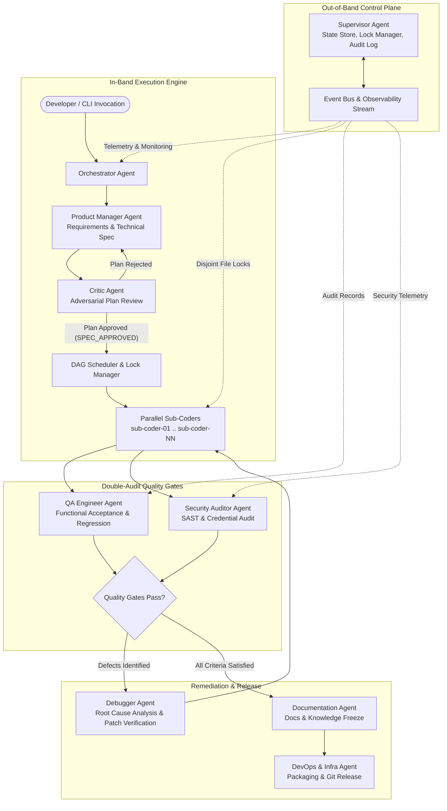

# Gemini Agent Team

Autonomous Multi-Agent Engineering Architecture for Antigravity, Gemini CLI, Claude Code, and CLI tools.

## Executive Summary

Gemini Agent Team is an enterprise-grade autonomous multi-agent software engineering framework designed for Antigravity, Gemini CLI, Claude Code, and terminal-based development environments. It orchestrates a specialized roster of 10 autonomous agents through a deterministic, contract-driven lifecycle. The system decouples the out-of-band control plane (Supervisor, Event Bus, State Store, Concurrency Lock Manager) from the in-band execution engine (Orchestrator, Product Manager, Critic, Parallel Sub-Coders, QA Engineer, Security Auditor, Debugger, and Documentation). By enforcing mathematical sub-coder task sizing (N <= 5 files per coder) and non-overlapping file allowlists, Gemini Agent Team enables high-velocity parallel software construction with zero write collisions and automated double-audit quality gates.

## Architecture

The architecture coordinates execution across three decoupled layers: the Out-of-Band Control Plane, the In-Band Execution Engine, and the Double-Audit Remediation and Release Loop.



### Core Architecture Invariants

- Out-of-Band Control Plane: The Supervisor operates outside the conversational context window, maintaining state in SQLite and JSON logs to prevent context degradation.
- Strict Concurrency Partitioning: Parallel sub-coders are assigned disjoint file allowlists; shared files are guarded by centralized locks.
- Dynamic Sub-Coder Sizing: Work units are sized dynamically using N = ceil(TotalFiles / 3.5), strictly clamped to a maximum ceiling of 5 files per sub-coder.
- Double-Audit Verification: Code must satisfy independent, automated audits from both QA (functional validation) and Security (SAST/secret leak scanning) before freeze.
- Pragmatic Remediation Loop: Failures trigger the Debugger agent for surgical root-cause remediation without restarting the entire workflow.

## Complete Agent Roster

The framework employs 10 specialized agent roles across the entire software delivery lifecycle:

| Agent Identifier | Role | Core Responsibilities | Recommended Model Tier |
| :--- | :--- | :--- | :--- |
| supervisor-agent | Out-of-Band Control Plane & Observability | State store management (SQLite/JSON), audit logging, file guard and concurrency locks, system telemetry, heartbeat monitoring. | Flagship Reasoning (Gemini 2.5 Pro / Claude 3.7 Sonnet) |
| orchestrator-agent | In-Band Workflow & DAG Coordination | Execution DAG scheduling, agent dispatch, task lifecycle tracking, inter-agent message routing, phase transition management. | Flagship Reasoning (Gemini 2.5 Pro / Claude 3.7 Sonnet) |
| pm-agent | Requirements Discovery & Spec Authoring | Problem framing, user intent clarification, technical specification authoring, sub-coder task sizing (N <= 5 files/agent). | High-Context Generalist (Gemini 2.5 Pro / Claude 3.7 Sonnet) |
| critic-agent | Adversarial Plan Critique & Quality Gate | Pre-flight adversarial review, 6-pillar critique matrix (feasibility, edge cases, contracts, concurrency, security, testability), plan sign-off. | Deep Reasoning (Gemini 2.5 Pro Thinking / Claude 3.7 Sonnet Thinking) |
| sub-coder | Parallel Surgical Code Generation | Disjoint file implementation against verbatim contract enclaves, localized unit testing, syntax validation, strict diff compliance. | High-Throughput Coding (Gemini 2.5 Flash / Claude 3.5 Sonnet) |
| qa-agent | Quality Assurance & Functional Verification | Automated test suite execution, blackbox/whitebox test suites, regression analysis, measurable acceptance criteria validation. | High-Throughput Coding / Reasoning (Gemini 2.5 Pro / Flash) |
| security-agent | Security Hardening & Vulnerability Audit | Static Application Security Testing (SAST), secret leak detection, dependency vulnerability scanning, authorization and permission review. | Deep Reasoning / Security (Gemini 2.5 Pro / Claude 3.7 Sonnet) |
| debugger-agent | Remediation & Root Cause Analysis | Pragmatic failure diagnosis, stack trace inspection, surgical patch generation, remediation loop verification. | High-Context Debugging (Gemini 2.5 Pro / Claude 3.7 Sonnet) |
| doc-refactor-agent | Technical Documentation & Knowledge Management | Technical documentation authoring, README maintenance, architectural diagrams, code comments hygiene, style and formatting compliance. | Balanced Generalist (Gemini 2.5 Flash / Pro) |
| devops-infra-agent | Release Engineering & Environment Operations | Environment verification (doctor.py), packaging, CI/CD pipeline automation, Git repository lifecycle, release tag management. | Fast Automation / Tooling (Gemini 2.5 Flash) |

## Installation

Choose one of the following installation methods based on your runtime environment.

### 1. Marketplace Installation (Claude Code & Antigravity)

Add the repository as a marketplace catalog and install the plugin:

```bash
/plugin marketplace add Kaivian/gemini-agent-team
/plugin install agent-team@gemini-agent-team
```

### 2. One-Line PowerShell Command (Windows)

Run the automated installer in PowerShell:

```powershell
irm https://raw.githubusercontent.com/Kaivian/gemini-agent-team/main/install.ps1 | iex
```

### 3. One-Line Bash Command (Linux / macOS)

Run the automated installer in POSIX Bash:

```bash
curl -fsSL https://raw.githubusercontent.com/Kaivian/gemini-agent-team/main/install.sh | bash
```

### 4. Antigravity CLI Command

Install the plugin directly from a local clone or directory path:

```bash
agy plugin install <directory>
```

Example for local plugin directory:

```bash
agy plugin install C:\Users\Kaivian\.gemini\config\plugins\agent-team
```

### 5. Git Clone Manual Setup

Clone the repository directly into your plugin directory:

```bash
git clone https://github.com/Kaivian/gemini-agent-team.git C:\Users\Kaivian\.gemini\config\plugins\agent-team
cd C:\Users\Kaivian\.gemini\config\plugins\agent-team
python scripts/doctor.py
```

## Environment Diagnostics

Gemini Agent Team provides a built-in diagnostic utility to verify system prerequisites, manifest integrity, and agent roster readiness:

```bash
python scripts/doctor.py
```

### Verification Checks Performed:
- Python Environment: Verifies Python 3.10+ runtime.
- SQLite3 Engine: Validates built-in SQLite3 availability for the Supervisor control plane.
- Git CLI: Verifies git executable availability in system PATH.
- Manifest Validation: Confirms JSON schema validity for `plugin.json`, `gemini-extension.json`, and `.claude-plugins/marketplace.json`.
- Agent Roster Integrity: Confirms presence of all 10 agent specifications in `agents/`.

Diagnostic output uses structured bracketed tags (`[PASS]`, `[WARN]`, `[FAIL]`) and returns exit code `0` on success or `1` on failure.

## Usage Guide

Activate the multi-agent workflow using the `/agent-team` skill command:

```bash
/agent-team "<task-description>" [options]
```

### Common Commands:

Standard autonomous task execution:
```bash
/agent-team "Implement user authentication with JWT, refresh tokens, and rate limiting"
```

Limit sub-coder concurrency:
```bash
/agent-team "Refactor database access layer to async SQLAlchemy" --concurrency 2
```

Dry-run mode (generates Technical Specification and DAG without file writes):
```bash
/agent-team "Migrate REST endpoints to GraphQL schema" --dry-run
```

### Execution Lifecycle Phases:
1. Discovery & Local Ingestion: Maps existing codebase, conventions, and dependencies.
2. Requirements Alignment: Clarifies scope, boundary conditions, and acceptance criteria.
3. Technical Specification Authoring: Defines file allowlists and contract enclaves.
4. Adversarial Plan Review: Evaluates the plan against the 6-pillar critique matrix.
5. Dynamic Sub-Coder Sizing & Parallel Execution: Dispatches sub-coders across disjoint file sets.
6. Double-Audit Gates: Executes automated test suites (QA) and SAST scans (Security).
7. Post-QA Freeze & Documentation: Freezes codebase, updates documentation, and finalizes release.

## License

This project is licensed under the MIT License. See [LICENSE](LICENSE) for details.
